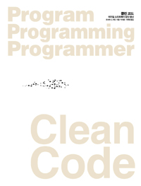
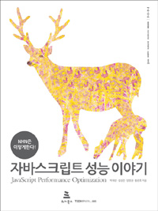
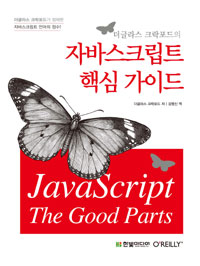

# girin-dev의 추천도서

## Clean Code
로버트 마틴 지음 | 인사이트

Code를 샀어야 하는데 잘못 샀음. 하지만 잠깐 읽어본 결과 주로 코딩 스타일과 개발자로서의 자세를 담고 있는 책으로 추측.

[자세히 보기](http://www.aladin.co.kr/shop/wproduct.aspx?ItemId=34083680)

---

## NHN은 이렇게 한다! 자바스크립트 성능 이야기
박재성, 심상민, 양정권, 황준호 지음 | 위키북스

자바스크립트 성능 최적화에 대한 이야기인 것 같아서 궁금함.

[자세히 보기](http://www.aladin.co.kr/shop/wproduct.aspx?ItemId=19506059)

---

## 자바스크립트 핵심 가이드
더글라스 크락포드 지음 | 한빛미디어

웅모쌤한테 추천받은 책 중 하나인데, 우연히 책을 얻었음. 근데 이미 다른 분들은 다 읽은 책일지도...

[자세히 보기](http://www.aladin.co.kr/shop/wproduct.aspx?ItemId=2608820)

---

## 이 밖에도 읽고 싶거나 사놓고 안 읽은 책
### CODE 
찰스 펫졸드 지음 | 인사이트

사실 저번에 읽어야 했지만 책을 잘못사서 읽지 못한 책. 아직 못 읽으셨다면 다같이 도전? [자세히보기](http://www.aladin.co.kr/shop/wproduct.aspx?ItemId=53051178)

### 객체지향 자바스크립트의 원리
니콜라스 자카스 지음 | 비제이퍼블릭

엄청 얇아 쉽게 생각하고 샀지만 귀차니즘을 극복하지 못하고 책장에 꽂혀있음. 함수형 프로그래밍에 관심이 생겼지만 객체지향 자바스크립트도 알면 좋지 않을까요? [자세히 보기](http://www.aladin.co.kr/shop/wproduct.aspx?ItemId=53810401)

### 라틴아메리카 경제의 이해 
김기현, 권기수 지음 | 한울
[자세히 보기](http://www.aladin.co.kr/shop/wproduct.aspx?ItemId=106419727)
### 나치즘과 동성애
김학이 지음 | 문학과지성사
[자세히 보기](http://www.aladin.co.kr/shop/wproduct.aspx?ItemId=32807999)
마지막 두 권은 최근에 읽고 싶어서 알라딘 보관함에 담아둔 책 입니다...ㅋㅋ